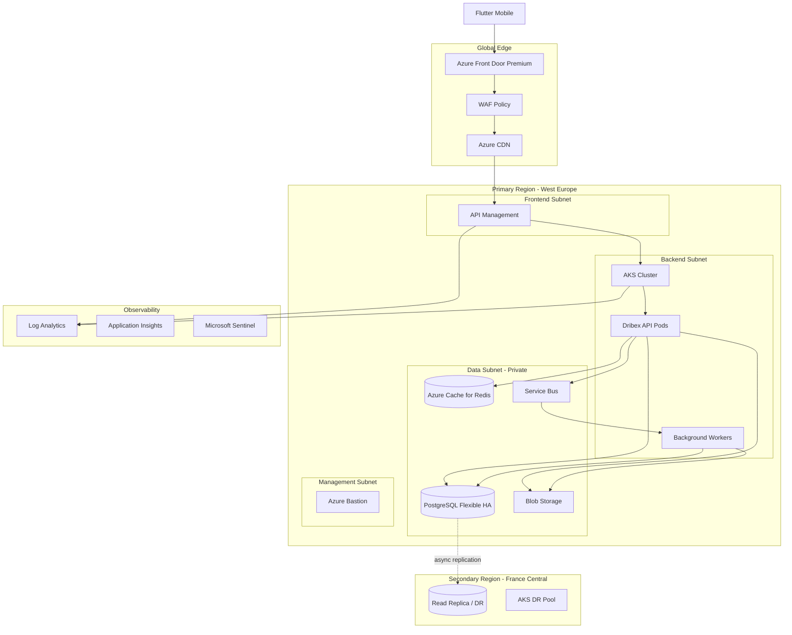

# Architecture Overview

## Design goals

Dribex is a local discovery marketplace (Flutter + FastAPI + PostgreSQL). This blueprint scales the **infrastructure** without changing application business logic until optional integration phases.

## High-level architecture (future state)

## Layer responsibilities

| Layer | Service | Justification |
|-------|---------|---------------|
| Edge | Front Door Premium | Global TLS, HTTP/3, geo routing, automatic failover |
| Security | WAF | OWASP CRS, bot protection, rate limiting at edge |
| API | API Management | Centralized JWT validation, throttling, versioning, analytics |
| Compute | AKS | Horizontal pod autoscaling, rolling/canary deploys, stateless API |
| Bridge | App Service (optional) | Intermediate migration from Container Apps with same container image |
| Data | PostgreSQL Flexible | Managed HA, PITR, read replicas, private access |
| Cache | Redis | Sessions, rate limits, hot seller listings, APIM cache |
| Storage | Blob (GRS) | Media uploads with lifecycle + immutability for backups |
| Messaging | Service Bus | Email, image processing, notifications, analytics |
| Events | Event Grid | Blob upload triggers, audit fan-out |
| Search | Azure AI Search | Full-text + geo ranking at scale (optional module) |
| AI | Azure OpenAI (optional) | Future NL search / recommendations — dormant module |
| Identity | Entra ID + MI | No secrets in code; workload identity for AKS |
| Secrets | Key Vault | JWT keys, DB URLs, SMTP, storage — rotation policies |
| Security | Defender + Sentinel | CSPM, threat detection, SIEM |
| Observability | Monitor + App Insights | SLO dashboards, distributed tracing, alerts |

## Availability target

- **99.95%** regional API (AKS + APIM + Front Door health probes)
- **99.99%** data durability (PostgreSQL HA + GRS blob + geo-redundant backups)
- RTO **< 1 hour** (warm DR region), RPO **< 5 minutes** (async replication)

## Stateless services

The FastAPI application is already stateless (JWT + PostgreSQL). Blueprint adds:

- Redis for rate limiting across replicas (already supported via `REDIS_URL` in Container Apps terraform)
- Service Bus for async work currently done inline (email, image metadata)

## Microservice-ready, monolith-first

Phase 1 keeps a **single API deployment** on AKS. Background workers are separate Deployments consuming Service Bus queues. Future services (recommendations, search indexer) deploy as additional pods without splitting the monolith prematurely.

## Module activation matrix

| Phase | Modules enabled | App changes |
|-------|-----------------|-------------|
| 0 (today) | None | None |
| 1 | networking, keyvault, postgresql, storage, monitoring | Env vars only (private endpoints) |
| 2 | aks, redis, apim, frontdoor | APIM base URL in mobile `API_BASE_URL` |
| 3 | servicebus, workers | Feature flag `ASYNC_JOBS=true` (future) |
| 4 | search, ai | Optional search backend switch |
| 5 | Multi-region | DNS / Front Door origin groups |

See [11-migration-path.md](11-migration-path.md).
