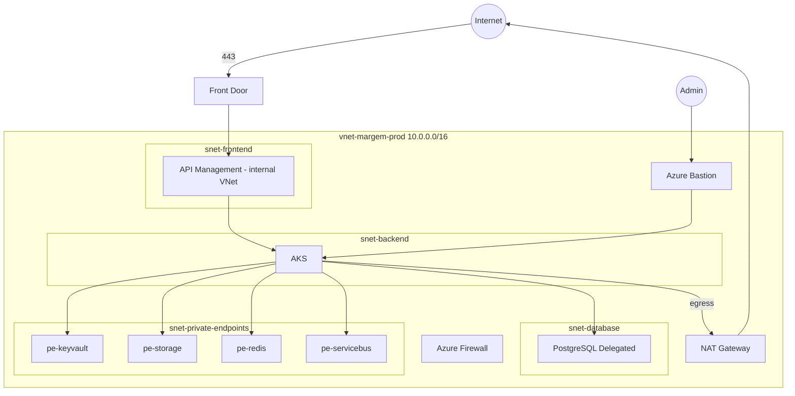

# Network Topology

## VNet design

**Address space:** `10.0.0.0/16` (expandable to `/15` for multi-region peering)

| Subnet | CIDR | Purpose | NSG |
|--------|------|---------|-----|
| `snet-frontend` | `10.0.1.0/24` | APIM internal / App Gateway ingress | `nsg-frontend` |
| `snet-backend` | `10.0.2.0/23` | AKS node pools | `nsg-backend` |
| `snet-database` | `10.0.4.0/24` | PostgreSQL delegated subnet | `nsg-database` |
| `snet-private-endpoints` | `10.0.5.0/24` | Private Link endpoints | `nsg-pe` |
| `snet-management` | `10.0.6.0/27` | Bastion, jump automation | `nsg-mgmt` |
| `AzureFirewallSubnet` | `10.0.7.0/26` | Azure Firewall (optional) | — |
| `GatewaySubnet` | `10.0.8.0/27` | VPN/ExpressRoute (future) | — |

## Topology diagram

## NSG rules (summary)

### Frontend (`nsg-frontend`)
- **Inbound:** Allow 443 from AzureFrontDoor.Backend only (service tag)
- **Deny:** All other inbound
- **Outbound:** Allow to backend subnet on 443/8000

### Backend (`nsg-backend`)
- **Inbound:** Allow from frontend subnet to node ports
- **Outbound:** Allow to private endpoints, database subnet, NAT

### Database (`nsg-database`)
- **Inbound:** Allow 5432 from backend subnet only
- **Deny:** All internet

### Private endpoints (`nsg-pe`)
- **Inbound:** Allow from backend + management subnets

## Private DNS zones

| Zone | Linked service |
|------|----------------|
| `privatelink.postgres.database.azure.com` | PostgreSQL |
| `privatelink.blob.core.windows.net` | Blob Storage |
| `privatelink.vaultcore.azure.net` | Key Vault |
| `privatelink.redis.cache.windows.net` | Redis |
| `privatelink.servicebus.windows.net` | Service Bus |
| `privatelink.azurecr.io` | Container Registry |
| `privatelink.search.windows.net` | Azure AI Search |

## DDoS Protection

- **DDoS Network Protection Standard** on the VNet (enabled in production `module_flags.ddos_protection`)
- Front Door provides additional L7 DDoS mitigation

## No public database or storage

- PostgreSQL: `public_network_access_enabled = false`, private DNS only
- Storage: `public_network_access_enabled = false`, access via Private Endpoint + Managed Identity
- Key Vault: `public_network_access_enabled = false`

## Hub-spoke (future)

For multi-region active-active, add a **hub VNet** with Firewall and peer production + DR spokes. Module `networking` supports `enable_hub_spoke` flag (disabled by default).
