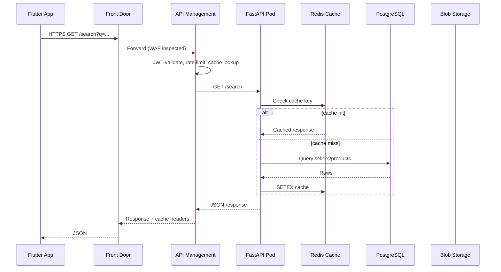
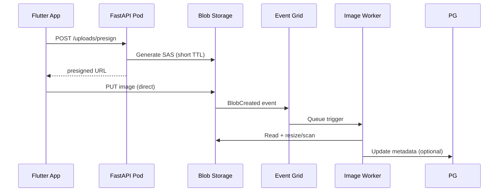

# Data Flow

## Synchronous API path (buyer/seller)

## Media upload path

## Async messaging (Phase 3)

| Queue / Topic | Producer | Consumer | Current inline equivalent |
|---------------|----------|----------|-------------------------|
| `email-send` | API | email-worker | `email_service.send()` |
| `signup-otp` | API | email-worker | signup OTP email |
| `image-process` | Event Grid | image-worker | Direct upload finalize |
| `notifications` | API | notify-worker | Future push notifications |
| `analytics` | API | analytics-worker | Counter bumps |
| `audit-log` | API | sentinel-ingest | Access logs |

**Constraint:** Workers are **new Deployments** — API behavior unchanged until `ASYNC_JOBS=true` feature flag enables queue publish instead of inline calls.

## Search data flow (optional Azure AI Search)

1. **Indexer** (Azure Function or worker) reads PostgreSQL changefeed / polling
2. Pushes documents to Azure AI Search index `sellers-products`
3. APIM routes `/search` to search service OR API proxies (backward compatible)
4. Mobile client unchanged if API preserves response schema

## Correlation IDs

- APIM injects `X-Correlation-ID` if missing
- FastAPI middleware logs correlation ID (existing `margem.access` logger)
- Application Insights links requests across APIM → API → PostgreSQL dependencies

## Data residency

- Primary: **West Europe** (Morocco proximity + EU data boundary options)
- DR: **France Central**
- Blob GRS: secondary in paired region
