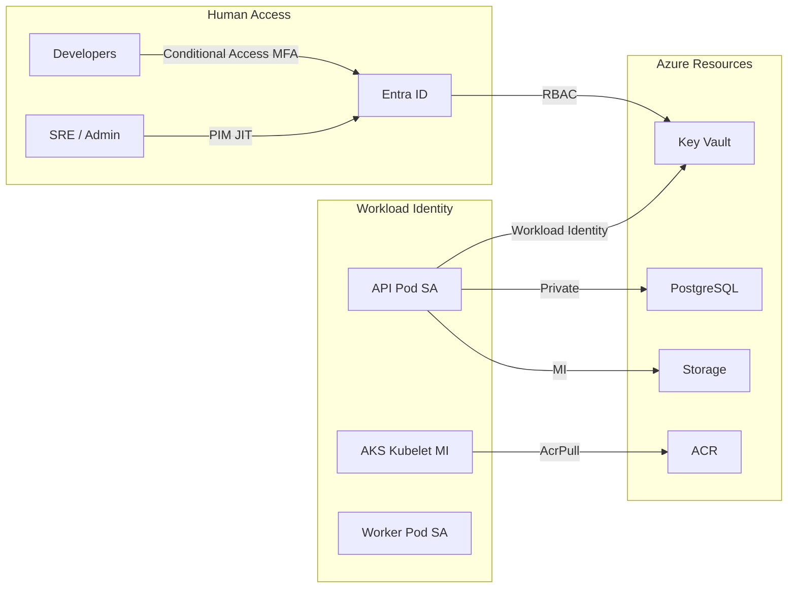

# Security Architecture

## Zero Trust principles

1. **Verify explicitly** — Entra ID for humans, Managed Identity for workloads
2. **Least privilege** — RBAC at subscription, resource group, Key Vault, AKS level
3. **Assume breach** — Private endpoints, no public DB, Defender monitoring

## Identity model

## Secret management

| Secret | Storage | Rotation |
|--------|---------|----------|
| JWT signing key | Key Vault | 90 days, dual-key overlap |
| Upload token secret | Key Vault | 90 days |
| Database URL | Key Vault | On credential rotation |
| SMTP password | Key Vault | 180 days |
| Storage | Managed Identity | N/A (no connection string in prod) |

**No secrets in:** Git, container images, mobile app, Terraform state (use Key Vault references).

## API security (APIM policies)

- JWT validation against Dribex issuer (`jwt_issuer` from app config)
- Rate limit: 300 req/min per IP (matches current `RATE_LIMIT`)
- Auth endpoints: 30 req/min (matches `AUTH_RATE_LIMIT`)
- Request size cap: 8 MB (matches `max_upload_bytes`)
- CORS: explicit origins only (no `*`)

## Defender for Cloud

| Plan | Scope |
|------|-------|
| Defender for Containers | AKS |
| Defender for Storage | Blob accounts |
| Defender for Databases | PostgreSQL |
| Defender for Key Vault | Key Vault |
| Defender CSPM | Subscription |

## Microsoft Sentinel

- Log Analytics workspace as primary SIEM
- Data connectors: AKS, Key Vault, PostgreSQL audit, APIM, Front Door
- Analytics rules: brute-force auth, impossible travel, privilege escalation

## Compliance alignment

| Framework | Blueprint controls |
|-----------|-------------------|
| OWASP API Top 10 | APIM auth, rate limits, input validation passthrough |
| OWASP ASVS | TLS 1.2+, secret management, audit logging |
| NIST CSF | Identify/Protect/Detect/Respond/Recover modules |
| CIS Azure | Azure Policy initiatives in `security` module |

## Network security

- Azure Firewall (optional): egress filtering for AKS
- Private Link for all PaaS data planes
- Bastion-only administrative access (no public SSH)

See [10-security-checklist.md](10-security-checklist.md) for pre-go-live gates.
