# Deployment Architecture

## CI/CD overview

The **current** pipeline remains `.github/workflows/margem-ci.yml` (unchanged).

The **future** enterprise pipeline is documented as an **example only**:

`souq-local/infra/blueprint/.github/workflows/azure-enterprise-cicd.yml.example`

**Not wired to any GitHub trigger.** Copy and customize when activating the blueprint.

## Pipeline stages

```mermaid
flowchart LR
    subgraph ci [CI]
        BUILD[Build]
        UNIT[Unit Tests]
        LINT[Lint]
        SAST[SAST - CodeQL]
        DEPS[Dependency Scan]
        SECRET[Secret Scan - Gitleaks]
        CONTAINER[Container Scan - Trivy]
        TFSCAN[Terraform Scan - Checkov]
        SBOM[SBOM - Syft]
        SIGN[Cosign Sign]
    end

    subgraph cd [CD]
        TF_PLAN[Terraform Plan]
        TF_APPLY[Terraform Apply]
        DEPLOY_AKS[AKS Deploy]
        SMOKE[Smoke Tests]
        CANARY[Canary 10%]
        PROMOTE[Promote 100%]
    end

    BUILD --> UNIT --> LINT --> SAST --> DEPS --> SECRET
    SECRET --> CONTAINER --> TFSCAN --> SBOM --> SIGN
    SIGN --> TF_PLAN --> TF_APPLY --> DEPLOY_AKS --> SMOKE --> CANARY --> PROMOTE
```



## Deployment strategies

| Strategy | Use case | Implementation |
|----------|----------|----------------|
| **Rolling** | Default API deploys | AKS `RollingUpdate`, `maxUnavailable: 0` |
| **Blue-Green** | Major releases | Second deployment + APIM traffic split |
| **Canary** | Risky changes | Flagger / Argo Rollouts or APIM % routing |

## AKS deployment manifest (conceptual)

```yaml
# blueprint/kubernetes/api-deployment.yaml.example — NOT applied automatically
apiVersion: apps/v1
kind: Deployment
metadata:
  name: margem-api
spec:
  replicas: 3
  strategy:
    type: RollingUpdate
    rollingUpdate:
      maxSurge: 1
      maxUnavailable: 0
  template:
    spec:
      serviceAccountName: margem-api
      containers:
        - name: api
          image: ${ACR}/margem-api:${VERSION}
          ports:
            - containerPort: 8000
          livenessProbe:
            httpGet:
              path: /live
              port: 8000
          readinessProbe:
            httpGet:
              path: /ready
              port: 8000
          resources:
            requests:
              cpu: 250m
              memory: 512Mi
            limits:
              cpu: 1000m
              memory: 1Gi
```

## Environments

| Environment | Terraform workspace | Purpose |
|-------------|---------------------|---------|
| dev | `margem-blueprint-dev` | Module integration testing |
| staging | `margem-blueprint-staging` | Pre-prod validation |
| production | `margem-blueprint-prod` | Live traffic |

Each uses separate state backends (`backends/*.backend.hcl.example`).

## Container image

Same `backend/Dockerfile` as today — no application changes. Image scanned and signed before AKS deploy.

## Database migrations

- Init container or Job runs `alembic upgrade head` before new API revision serves traffic
- Matches current Container Apps startup behavior

## Rollback

1. `kubectl rollout undo deployment/margem-api`
2. Or APIM traffic shift to previous revision
3. Database: PITR restore only if migration is backward-incompatible (avoid via expand-contract pattern)
