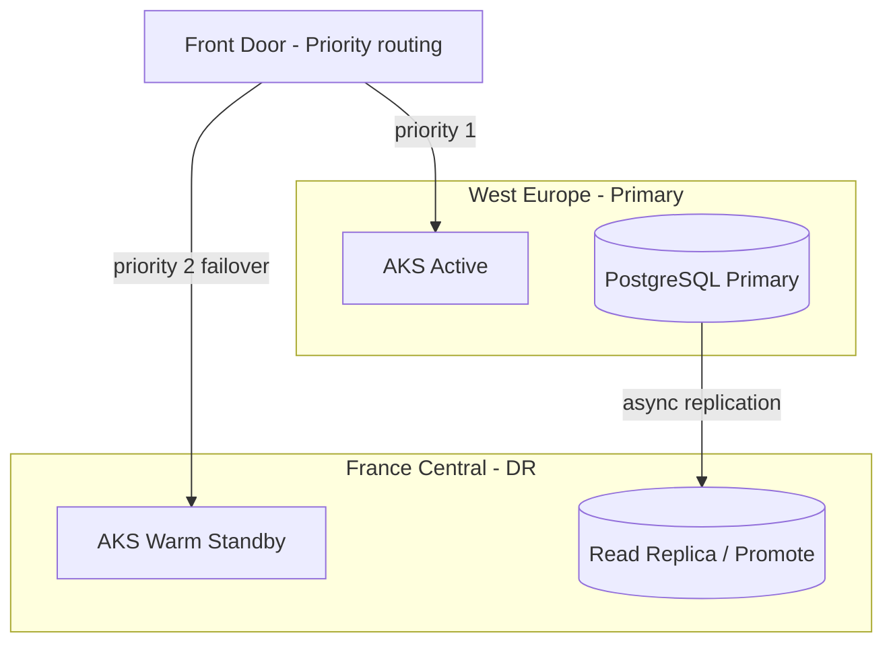

# Disaster Recovery Plan

## Objectives

| Metric | Target |
|--------|--------|
| **RPO** | ≤ 5 minutes (async PG replication + blob GRS) |
| **RTO** | ≤ 60 minutes (automated Front Door failover) |
| **Availability SLO** | 99.95% monthly |

## Failure scenarios

| Scenario | Detection | Response |
|----------|-----------|----------|
| Single API pod crash | K8s liveness probe | Self-heal restart |
| AZ failure | AKS zone redundancy | Pods reschedule |
| Region failure | Front Door health probes | Failover to DR origin |
| Database corruption | App errors + PG alerts | PITR restore |
| Key Vault compromise | Defender alert | Rotate keys, revoke MI |

## Multi-region architecture

## Failover runbook (region loss)

1. Confirm region outage via Azure Resource Health
2. Promote PostgreSQL read replica in DR region (manual or scripted)
3. Scale AKS DR cluster to production replica count
4. Front Door automatic origin failover (health probe failure)
5. Verify `/health` and `/ready` on DR endpoint
6. Update status page / notify users

## Failback

1. Restore primary region infrastructure
2. Re-establish replication primary → DR
3. Shift Front Door traffic back with weighted routing
4. Demote DR to read replica

## Testing

- **Quarterly:** Tabletop DR exercise
- **Bi-annually:** Full failover drill in staging
- **Monthly:** Backup restore validation (see [07-backup-strategy.md](07-backup-strategy.md))
